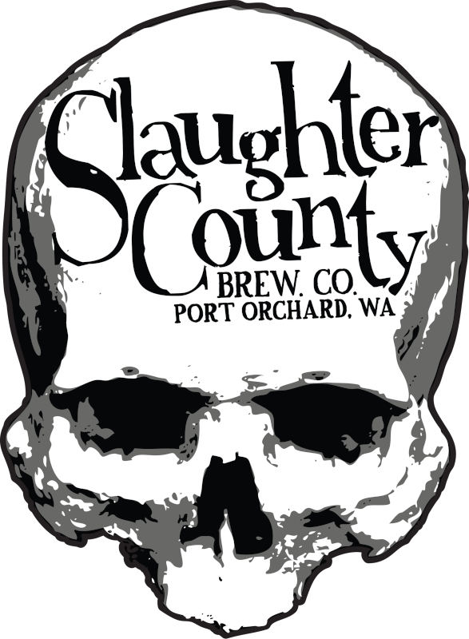

  
    <h1><a href="https://github.com/SlaughterCountyBrewing/SCBC_RecipeBook">SlaughterCountyBrewing/SCBC_RecipeBook</a></h1>
  <h3>Nulla nobis dicta iste minus dolor repellendus aspernatur atque</h3>
  
  
<!-- Badges -->

  
  
  
  
  
  
  <a href="https://discord.gg/gQH4mXWQRT">
    <!---->
    
  </a>

   
<h4>
    <a href="https://tinyurl.com/3vf7whyd">View Demo</a>
   · 
    <a href="https://github.com/SlaughterCountyBrewing/SCBC_RecipeBook/blob/main/README.md">Documentation</a>
   · 
    <a href="https://github.com/SlaughterCountyBrewing/SCBC_RecipeBook/issues/new?labels=bug&title=%5BBUG%5D">Report Bug</a>
   · 
    <a href="https://github.com/SlaughterCountyBrewing/SCBC_RecipeBook/issues/new?labels=enhancement&title=%5BFEATURE+REQUEST%5D">Request Feature</a>
  </h4>

**SCBC_Recipebook** is voluptatibus magni nemo est. Nulla nobis dicta iste minus dolor repellendus aspernatur atque. Earum expedita aut inventore tempora fugiat deleniti. Molestias minima nam expedita beatae totam ipsa reprehenderit animi. Occaecati quibusdam beatae ducimus voluptate ut doloribus vitae amet. Quia ut ut voluptate dignissimos adipisci dolorum rem.

- [Blackjack Brown](src/BlackjackBrown.md)
- [Captain Howdy](src/CaptainHowdy.md)

[BlackjackBrown.jpg](assets/media/BlackjackBrown.jpg)  
[BlackjackBrown2.jpg](assets/media/BlackjackBrown2.jpg)  
[CaptainHowdy.jpg](assets/media/CaptainHowdy.jpg)  
[DubbleTeamSupreme (2).jpg](assets/media/DubbleTeamSupreme (2).jpg)  
[DubbleTeamSupreme.jpg](assets/media/DubbleTeamSupreme.jpg)  
[Gorst.jpg](assets/media/Gorst.jpg)  
[Hoptopod.jpg](assets/media/Hoptopod.jpg)  
[JulFruktsoppa.jpg](assets/media/JulFruktsoppa.jpg)  
[LonelyMountain.jpg](assets/media/LonelyMountain.jpg)  
[LunaNegra.jpg](assets/media/LunaNegra.jpg)  
[MonPetit_Tripel.jpg](assets/media/MonPetit_Tripel.jpg)  
[OCiardubhainsIrishStout.jpg](assets/media/OCiardubhainsIrishStout.jpg)  
[OatmealStout.jpg](assets/media/OatmealStout.jpg)  
[Outlane_log (2).jpg](assets/media/Outlane_log (2).jpg)  
[Outlane_log.jpg](assets/media/Outlane_log.jpg)  
[SkillShot.jpg](assets/media/SkillShot.jpg)  
[SlaughteredPig.jpg](assets/media/SlaughteredPig.jpg)  
[SleepyHallow.jpg](assets/media/SleepyHallow.jpg)  
[StarkeRoggenhasse.jpg](assets/media/StarkeRoggenhasse.jpg)  
[StarkeRoggenhasse_notes.jpg](assets/media/StarkeRoggenhasse_notes.jpg)  

Contributions / Contact
-----------------------
- Please [file an issue](https://github.com/SlaughterCountyBrewing/SCBC_RecipeBook/issues/new), or [grab a fork](https://github.com/SlaughterCountyBrewing/SCBC_RecipeBook/fork), hack away, and submit a [pull request](https://github.com/SlaughterCountyBrewing/SCBC_RecipeBook/pulls).
- Contact me at [linkedin.com/in/scottkirvan/](https://www.linkedin.com/in/scottkirvan/)
- You can also contact me at my [discord](https://discord.gg/TSKHvVFYxB) server, I'm cptvideo.

Credits
-------
**Copyright (c) (2024):** [Scott Kirvan](https://github.com/ScottKirvan)  - All rights reserved   
*SCBC_Recipebook is licensed under the [MIT License](LICENSE.md).*  

Project Link:  [SCBC_Recipebook](https://github.com/SlaughterCountyBrewing/SCBC_RecipeBook)  
[CHANGELOG](notes/CHANGELOG.md)  
[TODO](notes/TODO.md)
