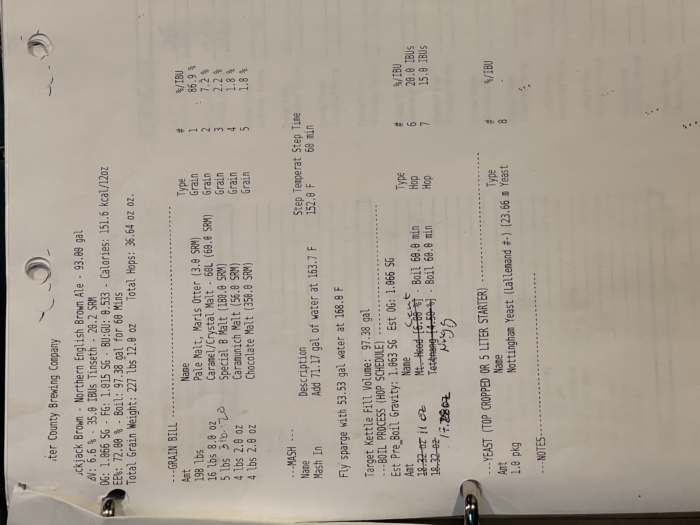
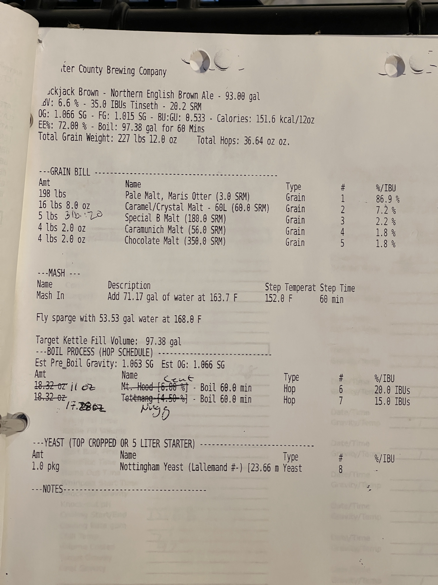

Here's the beer recipe converted to markdown:

# Blackjack Brown - Northern English Brown Ale
**Specs:** 93.00 gal | ABV: 6.6% | 35.0 IBUs Tinseth | 20.2 SRM  
**OG:** 1.066 SG | **FG:** 1.015 SG | **BU:GU:** 0.533 | **Calories:** 151.6 kcal/12oz  
**Eff:** 72.00% | **Boil:** 97.38 gal for 60 Mins  
**Total Grain Weight:** 227 lbs 12.0 oz | **Total Hops:** 36.64 oz oz.

## Grain Bill
| Amount        | Name                                  | Type  | #   | %/IBU |
| ------------- | ------------------------------------- | ----- | --- | ----- |
| 198 lbs       | Pale Malt, Maris Otter (3.0 SRM)      | Grain | 1   | 86.9% |
| 16 lbs 8.0 oz | Caramel/Crystal Malt - 60L (60.0 SRM) | Grain | 2   | 7.2%  |
| 5 lbs         | Special B Malt (180.0 SRM)            | Grain | 3   | 2.2%  |
| 4 lbs 2.0 oz  | Caramunich Malt (56.0 SRM)            | Grain | 4   | 1.8%  |
| 4 lbs 2.0 oz  | Chocolate Malt (350.0 SRM)            | Grain | 5   | 1.8%  |

## Mash
**Mash In:** Add 71.17 gal of water at 163.7 F | **Step Temperature:** 152.0 F | **Step Time:** 60 min

Fly sparge with 53.53 gal water at 168.0 F

Target Kettle Fill Volume: 97.38 gal

## Boil Process (Hop Schedule)
**Est Pre Boil Gravity:** 1.063 SG | **Est OG:** 1.066 SG

| Amount   | Name                             | Type | #   | %/IBU     |
| -------- | -------------------------------- | ---- | --- | --------- |
| 11 oz    | Mt. Hood [6.00%] - Boil 60.0 min | Hop  | 6   | 20.0 IBUs |
| 17.28 oz | Tettnang [4.50%] - Boil 60.0 min | Hop  | 7   | 15.0 IBUs |

## Yeast
| Amount  | Name                                     | Type  | #   | %/IBU |
| ------- | ---------------------------------------- | ----- | --- | ----- |
| 1.0 pkg | Nottingham Yeast (Lallemand #) [23.66 m] | Yeast | 8   | -     |

## Notes

