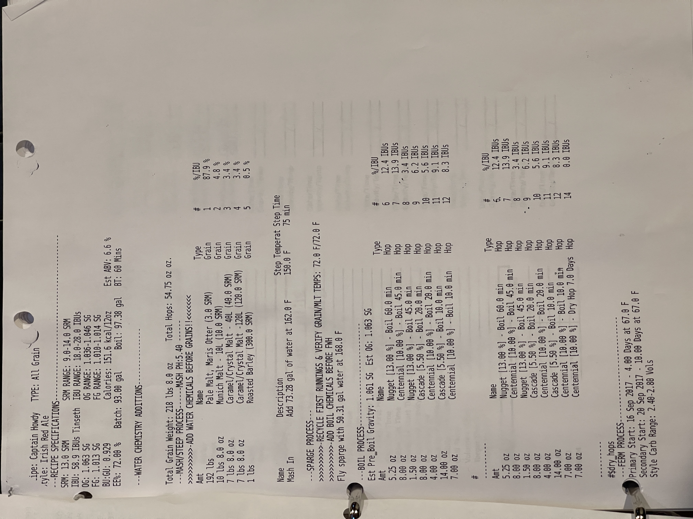

# Captain Howdy - Irish Red Ale (All Grain)

## Recipe Specifications
**SRM:** 13.0 SRM | **SRM RANGE:** 9.0-14.0 SRM  
**IBU:** 58.9 IBUs Tinseth | **IBU RANGE:** 18.0-28.0 IBUs  
**OG:** 1.063 SG | **OG RANGE:** 1.036-1.046 SG  
**FG:** 1.013 SG | **FG RANGE:** 1.010-1.014 SG  
**BU:GU:** 0.929 | **Calories:** 151.6 kcal/12oz | **Est ABV:** 6.6%  
**Eff:** 72.00% | **Batch:** 93.00 gal | **Boil:** 97.38 gal | **BT:** 60 Mins

**Total Grain Weight:** 218 lbs 8.0 oz | **Total Hops:** 54.75 oz oz.

## Mash/Steep Process (MASH PH:5.40)
> ADD WATER CHEMICALS BEFORE GRAINS! 

| Amount        | Name                                   | Type  | #   | %/IBU |
| ------------- | -------------------------------------- | ----- | --- | ----- |
| 192 lbs       | Pale Malt, Maris Otter (3.0 SRM)       | Grain | 1   | 87.9% |
| 10 lbs 8.0 oz | Munich Malt - 10L (10.0 SRM)           | Grain | 2   | 4.8%  |
| 7 lbs 8.0 oz  | Caramel/Crystal Malt - 40L (40.0 SRM)  | Grain | 3   | 3.4%  |
| 7 lbs 8.0 oz  | Caramel/Crystal Malt -120L (120.0 SRM) | Grain | 4   | 3.4%  |
| 1 lbs         | Roasted Barley (300.0 SRM)             | Grain | 5   | 0.5%  |

**Mash In:** Add 73.28 gal of water at 162.0 F | **Step Temperature:** 150.0 F | **Step Time:** 75 min

## Sparge Process
- RECYCLE FIRST RUNNINGS & VERIFY GRAIN/MLT TEMPS: 72.0 F/72.0 F
- ADD BOIL CHEMICALS BEFORE FWH
- Fly sparge with 50.31 gal water at 168.0 F

## Boil Process
**Est Pre Boil Gravity:** 1.061 SG | **Est OG:** 1.063 SG

| Amount   | Name                                   | Type | #   | %/IBU     |
| -------- | -------------------------------------- | ---- | --- | --------- |
| 5.25 oz  | Nugget [13.00%] - Boil 60.0 min        | Hop  | 6   | 12.4 IBUs |
| 8.00 oz  | Centennial [10.00%] - Boil 45.0 min    | Hop  | 7   | 13.9 IBUs |
| 1.50 oz  | Nugget [13.00%] - Boil 45.0 min        | Hop  | 8   | 3.4 IBUs  |
| 8.00 oz  | Cascade [5.50%] - Boil 20.0 min        | Hop  | 9   | 6.2 IBUs  |
| 4.00 oz  | Centennial [10.00%] - Boil 20.0 min    | Hop  | 10  | 5.6 IBUs  |
| 14.00 oz | Cascade [5.50%] - Boil 10.0 min        | Hop  | 11  | 9.1 IBUs  |
| 7.00 oz  | Centennial [10.00%] - Boil 10.0 min    | Hop  | 12  | 8.3 IBUs  |
| 7.00 oz  | Centennial [10.00%] - Dry Hop 7.0 Days | Hop  | 14  | 0.0 IBUs  |

## Fermentation
**Primary Start:** 16 Sep 2017 - 4.00 Days at 67.0 F  
**Secondary Start:** 20 Sep 2017 - 10.00 Days at 67.0 F  
**Style Carb Range:** 2.40-2.80 Vols

## Notes

