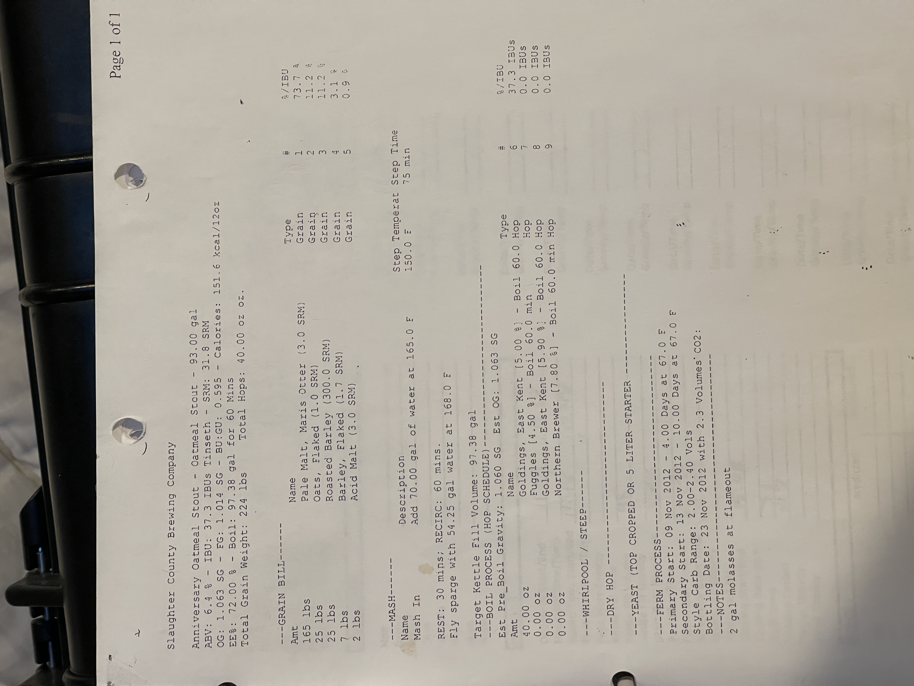

# The Crimp - Oatmeal Stout

**Specs:** 93.00 gal | **ABV:** 6.1 % | **IBUs:** 37.3 IBUs Tinseth | **SRM:** 31.8 SRM  
**OG:** 1.063 SG | **FG:** 1.014 SG | **BU:GU:** 0.345 | **Calories:** 151.6 kcal/12oz  
**Eff:** 72.00 % | **Boil:** 97.38 gal for 60 Mins  
**Total Grain Weight:** 224 lbs |   **Total Hops:**  40.00 oz

## Grain Bill
| Amount  | Name                             | Type  | #   | %/IBU  |
| ------- | -------------------------------- | ----- | --- | ------ |
| 165 lbs | Pale Malt, Maris Otter (3.0 SRM) | Grain | 1   | 73.7 % |
| 25 lbs  | Oats, Flaked (1.0 SRM)           | Grain | 2   | 11.2 % |
| 25 lbs  | Roasted Barley (300.0 SRM)       | Grain | 3   | 11.2 % |
| 7 lbs   | Barley, Flaked (1.7 SRM)         | Grain | 4   | 3.1 %  |
| 2 lbs   | Acid Malt (3.0 SRM)              | Grain | 5   | 0.9 %  |

## Mash
**Mash In:** - Add 70.00 gal of water at 165.0°F  | **Step Temperature:** 150.0°F  | **Step Time:** 75 mins  

Fly sparge with 54.25 gal water at 168.0°F  

Target Kettle Fill Volume: 97.38 gal

## Boil Process (Hop Schedule)
**Est Pre_Boil Gravity:** 1.060 SG |  **Est OG:** 1.063 SG
| Amt      | Name                         | Type    | Time     | #   | %/IBU     |
| -------- | ---------------------------- | ------- | -------- | --- | --------- |
| 40.00 oz | Goldings, East Kent [5.00 %] | Hop     | 60.0     | 6   | 37.3 IBUs |
| 0.00 oz  | Fuggles [4.50 %]             | Hop     | 60.0 min | 7   | 0.0 IBUs  |
| 0.00 oz  | Goldings, East Kent [5.90 %] | Hop     | 60.0     | 8   | 0.0 IBUs  |
| 0.00 oz  | Northern Brewer [7.80 %]     | Hop     | 60.0 min | 9   | 0.0 IBUs  |
| 2.00 gal | molasses                     | Adjunct | flameout | 10  | 0.0 IBUs  |

## Yeast
| Amount  | Name                                     | Type  | #   | %/IBU |
| ------- | ---------------------------------------- | ----- | --- | ----- |
| 1.0 pkg | Nottingham Yeast (Lallemand #) [23.66 m] | Yeast | 8   | -     |

## NOTES
2 gal molasses at flameout

