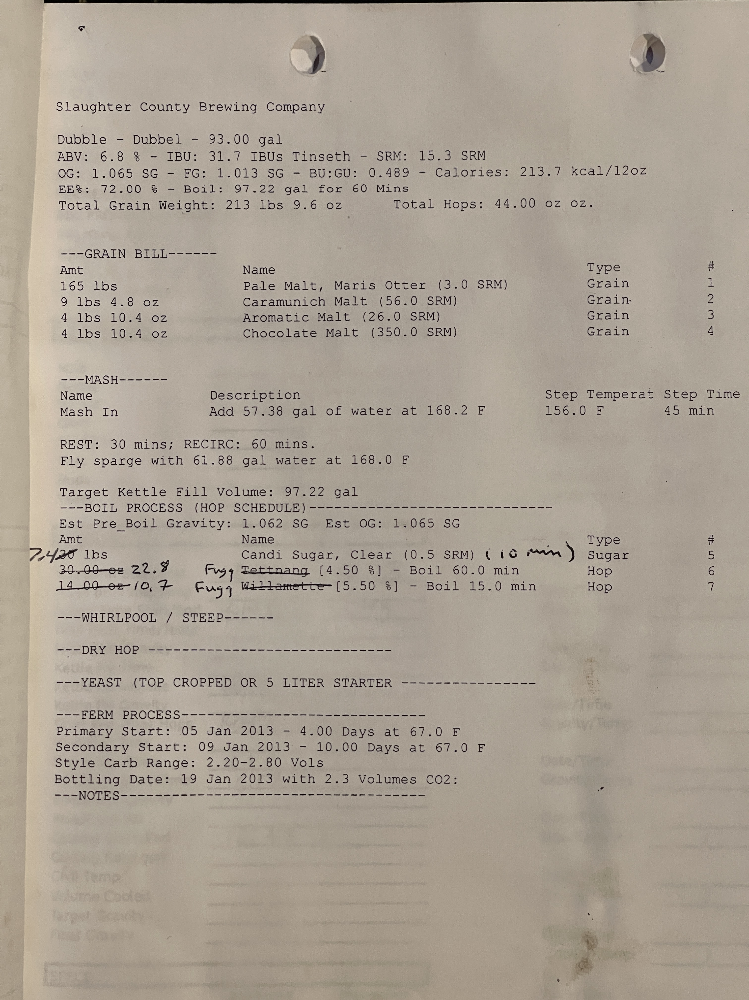

# Dubble Team Supreme - Belgian Dubbel
**Slaughter County Brewing Company**

**ABV:** 6.8% | **IBU:** 31.7 IBUs Tinseth | **SRM:** 15.3 SRM  
**OG:** 1.065 SG | **FG:** 1.013 SG | **BU:GU:** 0.489 | **Calories:** 213.7 kcal/12oz  
**EE%:** 72.00% | **Boil:** 97.22 gal for 60 Mins  
**Total Grain Weight:** 213 lbs 9.6 oz | **Total Hops:** 44.00 oz oz.

## Grain Bill
| Amount        | Name                             | Type  | #   |
| ------------- | -------------------------------- | ----- | --- |
| 165 lbs       | Pale Malt, Maris Otter (3.0 SRM) | Grain | 1   |
| 9 lbs 4.8 oz  | Caramunich Malt (56.0 SRM)       | Grain | 2   |
| 4 lbs 10.4 oz | Aromatic Malt (26.0 SRM)         | Grain | 3   |
| 4 lbs 10.4 oz | Chocolate Malt (350.0 SRM)       | Grain | 4   |

## Mash
**Mash In:** Add 57.38 gal of water at 168.2 F | **Step Temperature:** 156.0 F | **Step Time:** 45 min  
**REST:** 30 mins; **RECIRC:** 60 mins.  
Fly sparge with 61.88 gal water at 168.0 F

**Target Kettle Fill Volume:** 97.22 gal

## Boil Process
**Est Pre_Boil Gravity:** 1.062 SG | **Est OG:** 1.065 SG

| Amount  | Name                                  | Type  | #   |
| ------- | ------------------------------------- | ----- | --- |
| 7.5 lbs | Candi Sugar, Clear (0.5 SRM) (10 min) | Sugar | 5   |
| 22.8 oz | Tettnang [4.50%] - Boil 60.0 min      | Hop   | 6   |
| 10.7 oz | Willamette [5.50%] - Boil 15.0 min    | Hop   | 7   |

## Fermentation
**Primary Start:** 05 Jan 2013 - 4.00 Days at 67.0 F  
**Secondary Start:** 09 Jan 2013 - 10.00 Days at 67.0 F  
**Style Carb Range:** 2.20-2.80 Vols  
**Bottling Date:** 19 Jan 2013 with 2.3 Volumes CO2

## Notes

.jpg)