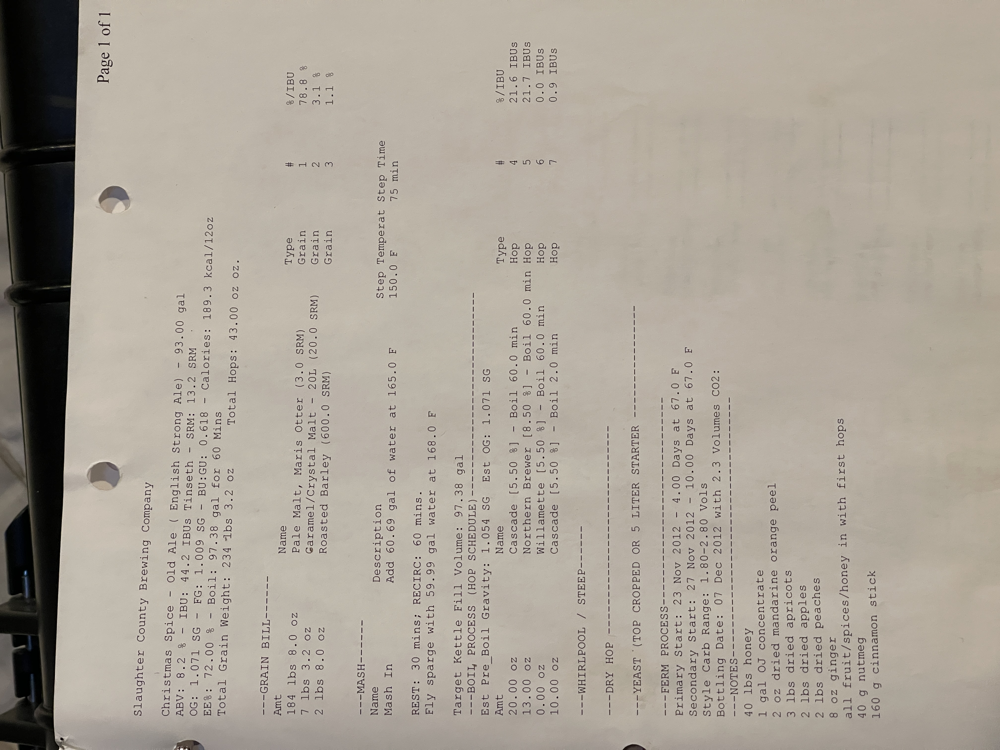

# Jul Fruktsoppa - Christmas Spice - English Strong

**Specs:** 93.00 gal | **ABV:** 8.2% | **IBU:** 44.2 IBUs Tinseth | **SRM:** 13.2 SRM  
**OG:** 1.071 SG | **FG:** 1.009 SG | **BU:GU:** 0.618 | **Calories:** 189.3 kcal/12oz  
**Eff:** 72.00% | **Boil:** 97.38 gal for 60 Mins  
**Total Grain Weight:** 234 lbs 3.2 oz | **Total Hops:** 43.00 oz

## Grain Bill
| Amount         | Name                                  | Type  | #   | %/IBU |
| -------------- | ------------------------------------- | ----- | --- | ----- |
| 184 lbs 8.0 oz | Pale Malt, Maris Otter (3.0 SRM)      | Grain | 1   | 78.8% |
| 7 lbs 3.2 oz   | Caramel/Crystal Malt - 20L (20.0 SRM) | Grain | 2   | 3.1%  |
| 2 lbs 0.0 oz   | Roasted Barley (600.0 SRM)            | Grain | 3   | 1.1%  |

## Boil Process (Hop Schedule) 

| Amount   | Name                                    | Type | #   | %/IBU     |
| -------- | --------------------------------------- | ---- | --- | --------- |
| 20.00 oz | Cascade [5.50%] - Boil 60.0 min         | Hop  | 4   | 21.6 IBUs |
| 13.00 oz | Northern Brewer [8.50%] - Boil 60.0 min | Hop  | 5   | 21.7 IBUs |
| 0.00 oz  | Willamette [5.50%] - Boil 60.0 min      | Hop  | 6   | 0.0 IBUs  |
| 10.00 oz | Cascade [5.50%] - Boil 2.0 min          | Hop  | 7   | 0.9 IBUs  |

## Special Ingredients
- 40 lbs honey
- 1 gal OJ concentrate
- 2 oz dried mandarine orange peel
- 3 lbs dried apricots
- 2 lbs dried apples
- 2 lbs dried peaches
- 8 oz ginger
- all fruit/spices/honey in with first hops
- 40 g nutmeg
- 160 g cinnamon stick

## Yeast

| Amount  | Name                                     | Type  | #   | %/IBU |
| ------- | ---------------------------------------- | ----- | --- | ----- |
| 1.0 pkg | Nottingham Yeast (Lallemand #) [23.66 m] | Yeast | 8   | -     |

## Notes
