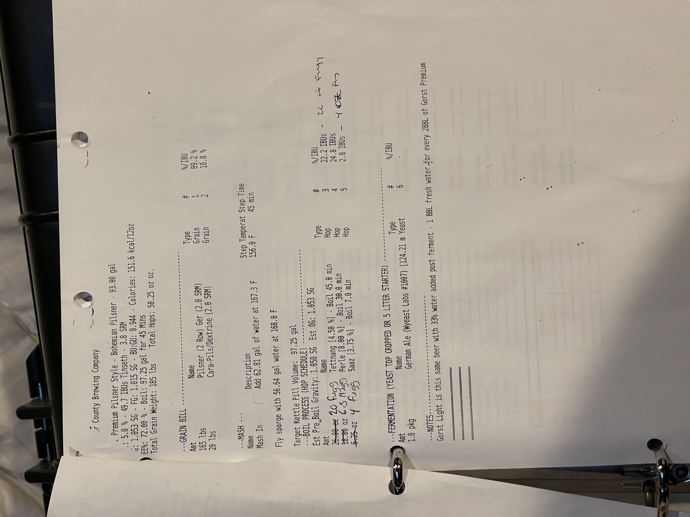

# Gorst Premium Pilsner Style - Bohemian Pilsner

**Specs:** 93.00 gal |**ABV:** 5.0% | **IBU:** 49.7 IBUs Tinseth | **SRM:** 3.8 SRM  
**OG:** 1.053 SG | **FG:** 1.015 SG | **BU:GU:** 0.944 | **Calories:** 151.6 kcal/12oz  
**EE%:** 72.00% | **Boil:** 97.25 gal for 45 Mins  
**Total Grain Weight:** 185 lbs | **Total Hops:** 50.25 oz oz.

## Grain Bill
| Amount  | Name                          | Type  | #   | %/IBU |
| ------- | ----------------------------- | ----- | --- | ----- |
| 165 lbs | Pilsner (2 Row) Ger (2.0 SRM) | Grain | 1   | 89.2% |
| 20 lbs  | Cara-Pils/Dextrine (2.0 SRM)  | Grain | 2   | 10.8% |

## Mash
**Mash In:** Add 62.81 gal of water at 167.3 F | **Step Temperature:** 156.0 F | **Step Time:** 45 min  
Fly sparge with 56.64 gal water at 168.0 F

**Target Kettle Fill Volume:** 97.25 gal

## Boil Process
**Est Pre_Boil Gravity:** 1.050 SG | **Est OG:** 1.053 SG

| Amount   | Name                             | Type | #   | %/IBU     |
| -------- | -------------------------------- | ---- | --- | --------- |
| 20 fuggs | Tettnang [4.50%] - Boil 45.0 min | Hop  | 3   | 22.2 IBUs |
| 25 fuggs | Perle [8.00%] - Boil 30.0 min    | Hop  | 4   | 24.8 IBUs |
| 4 fuggs  | Saaz [3.75%] - Boil 7.0 min      | Hop  | 5   | 2.8 IBUs  |

## Fermentation
| Amount  | Name                                      | Type  | #   | %/IBU |
| ------- | ----------------------------------------- | ----- | --- | ----- |
| 1.0 pkg | German Ale (Wyeast Labs #1007) [124.21 m] | Yeast | 6   | -     |

## Notes
Gorst Light is this same beer with 33% water added post ferment - 1 BBL fresh water for every 2BBL of Gorst Premium

