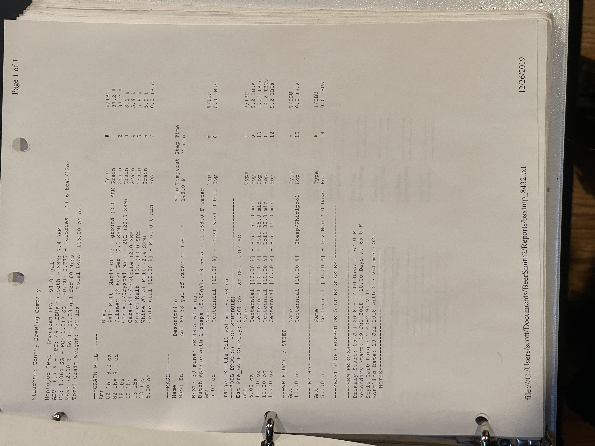

# Hoptopod IPA - American IPA

**Specs:** 93.00 gal |**ABV:** 6.7% | **IBUis:** 49.5 IBUs Tinseth | **SRM:** 7.4 SRM  
**OG:** 1.064 SG | **FG:** 1.013 SG | **BU:GU:** 0.777 | **Calories:** 151.6 kcal/12oz  
**Eff:** 72.00% | **Boil:** 97.38 gal for 60 Mins  
**Total Grain Weight:** 222 lbs | **Total Hops:** 105.00 oz oz.

## Grain Bill
| Amount        | Name                                      | Type  | #   | %/IBU |
| ------------- | ----------------------------------------- | ----- | --- | ----- |
| 82 lbs 8.0 oz | Pale Malt, Maris Otter - ground (3.0 SRM) | Grain | 1   | 37.2% |
| 82 lbs 8.0 oz | Pilsener (2 Row) Ger (2.0 SRM)            | Grain | 2   | 37.2% |
| 18 lbs        | Caramel/Crystal Malt - 20L (20.0 SRM)     | Grain | 3   | 8.1%  |
| 13 lbs        | Cara-Pils/Dextrine (2.0 SRM)              | Grain | 4   | 5.9%  |
| 13 lbs        | Munich Malt - 10L (10.0 SRM)              | Grain | 5   | 5.9%  |
| 13 lbs        | White Wheat Malt (2.4 SRM)                | Grain | 6   | 5.9%  |

## Hop Schedule
| Amount   | Name                                     | Type | #   | %/IBU     |
| -------- | ---------------------------------------- | ---- | --- | --------- |
| 5.00 oz  | Centennial [10.00%] - Mash 0.0 min       | Hop  | 7   | 0.0 IBUs  |
| 5.00 oz  | Centennial [10.00%] - First Wort 0.0 min | Hop  | 8   | 0.0 IBUs  |
| 5.00 oz  | Centennial [10.00%] - Boil 60.0 min      | Hop  | 9   | 9.2 IBUs  |
| 10.00 oz | Centennial [10.00%] - Boil 45.0 min      | Hop  | 10  | 17.0 IBUs |
| 10.00 oz | Centennial [10.00%] - Boil 30.0 min      | Hop  | 11  | 14.2 IBUs |
| 10.00 oz | Centennial [10.00%] - Boil 15.0 min      | Hop  | 12  | 9.2 IBUs  |
| 10.00 oz | Centennial [10.00%] - Steep/Whirlpool    | Hop  | 13  | 0.0 IBUs  |
| 50.00 oz | Centennial [10.00%] - Dry Hop 7.0 Days   | Hop  | 14  | 0.0 IBUs  |
## Yeast

| Amount  | Name                                     | Type  | #   | %/IBU |
| ------- | ---------------------------------------- | ----- | --- | ----- |
| 1.0 pkg | Nottingham Yeast (Lallemand #) [23.66 m] | Yeast | 8   | -     |

# Notes

