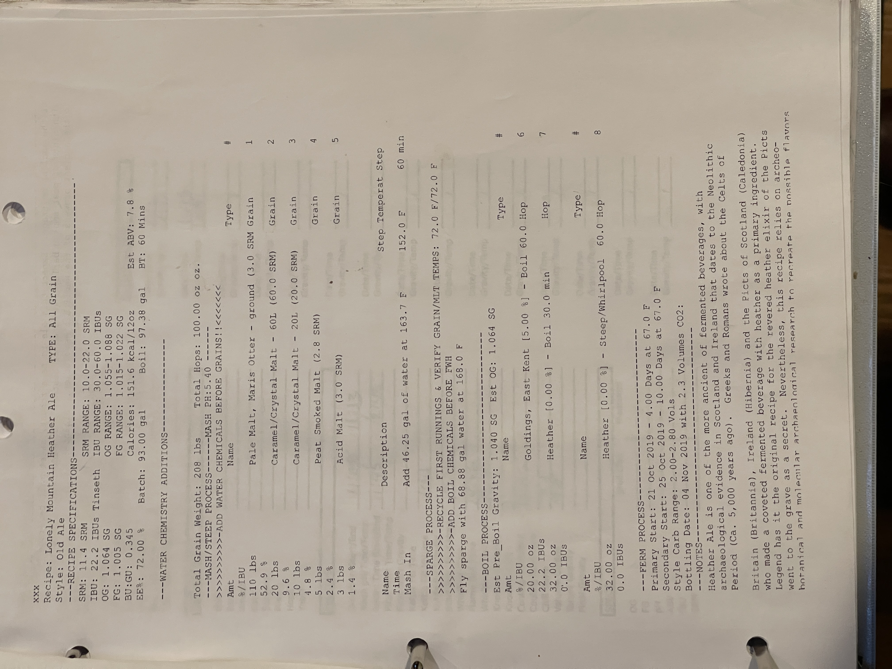

# Lonely Mountain Heather Ale  - Old Ale

**Specs:** 93.00 gal | **ABV:** 7.8% | **IBUs**: 22.2 IBUs Tinseth   | **SRM**: 11.4 SRM  
**OG**: 1.064 SG | **FG**: 1.005 SG | **BU:GU**: 0.345  | **Calories**: 151.6 kcal/12oz  
**Est. ABV**: 7.8%  | **Batch Size**: 93.00 gal  | **Boil Size**: 97.38 gal for 60 mins  

## Grain Bill
| Amount   | Name                                  | Type  | #   | %/IBU |
| -------- | ------------------------------------- | ----- | --- | ----- |
| 110 lbs  | Pale Malt, Maris Otter (3.0 SRM)      | Grain | 1   |       |
| 52.9 lbs | Caramel/Crystal Malt - 60L (60.0 SRM) | Grain | 2   |       |
| 20 lbs   | Caramel/Crystal Malt - 20L (20.0 SRM) | Grain | 3   |       |
| 5 lbs    | Peat Smoked Malt (2.8 SRM)            | Grain | 4   |       |
| 4 lbs    | Acid Malt (3.0 SRM)                   | Grain | 5   |       |

## Mash
**Mash In:** - Add 46.25 gal of water at 163.7°F  | **Step Temperature:** 152.0°F  | **Step Time:** 60 mins  

Fly sparge with 68.88 gal water at 168.0°F  

Target Kettle Fill Volume: 97.38 gal

## Boil Process (Hop Schedule)
**Est. Pre-Boil Gravity**: 1.040 SG  | **Est. OG**: 1.064 SG  

| Amt      | Name                        | Type | Time     | #   | %/IBU     |
| -------- | --------------------------- | ---- | -------- | --- | --------- |
| 20.00 oz | Goldings, East-Kent [5.00%] | Hop  | 60.0 min | 6   | 22.2 IBUs |
| 32.00 oz | Heather [0.00%]             | Boil | 30.0 min | 7   | 0.0 IBUs  |

## Steep/Whirlpool

| Amt      | Name            | Type | Time     | #   | %/IBU    |
| -------- | --------------- | ---- | -------- | --- | -------- |
| 32.00 oz | Heather [0.00%] | Hop  | 60.0 min | 8   | 0.0 IBUs |
## Yeast

|Amount|Name|Type|#|%/IBU|
|---|---|---|---|---|
|1.0 pkg|Nottingham Yeast (Lallemand #) [23.66 m]|Yeast|8|-|
## Notes

Heather Ale is one of the more ancient fermented beverages, with archaeological evidence in Scotland and Ireland that dates to the Neolithic Period (ca. 5,000 years ago). Greeks and Romans wrote about the Celts of Britain (Britannia), Ireland (Hibernia), and the Picts of Scotland (Caledonia) who made a coveted fermented beverage with heather as a primary ingredient. Legend has it the original recipe for the revered heather elixir of the Picts went to the grave as a secret. Nevertheless, this recipe relies on archaeological and molecular archaeological research to recreate the possible flavors and aromas.

