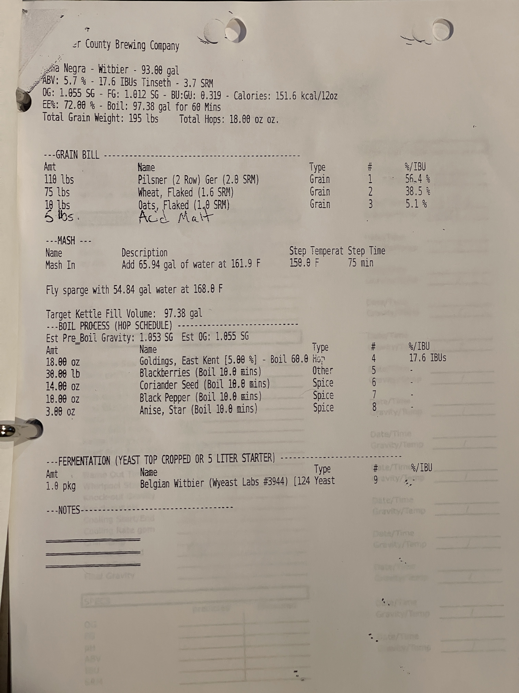

# Luna Negra Belgian White with Blackberries and Spices - Witbier
**County Brewing Company**

**ABV:** 5.7% | **IBU:** 17.6 IBUs Tinseth | **SRM:** 3.7 SRM  
**OG:** 1.055 SG | **FG:** 1.012 SG | **BU:GU:** 0.319 | **Calories:** 151.6 kcal/12oz  
**EE%:** 72.00% | **Boil:** 97.38 gal for 60 Mins  
**Total Grain Weight:** 195 lbs | **Total Hops:** 18.00 oz oz.

## Grain Bill
| Amount  | Name                          | Type  | #   | %/IBU |
| ------- | ----------------------------- | ----- | --- | ----- |
| 110 lbs | Pilsner (2 Row) Ger (2.0 SRM) | Grain | 1   | 56.4% |
| 75 lbs  | Wheat, Flaked (1.6 SRM)       | Grain | 2   | 38.5% |
| 10 lbs  | Oats, Flaked (1.0 SRM)        | Grain | 3   | 5.1%  |
| 5 lbs   | Acid Malt                     | Grain | -   | -     |

## Mash
**Mash In:** Add 65.94 gal of water at 161.9 F | **Step Temperature:** 150.9 F | **Step Time:** 75 min  
Fly sparge with 54.84 gal water at 168.0 F

**Target Kettle Fill Volume:** 97.38 gal

## Boil Process
**Est Pre_Boil Gravity:** 1.053 SG | **Est OG:** 1.055 SG

| Amount   | Name                                        | Type  | #   | %/IBU     |
| -------- | ------------------------------------------- | ----- | --- | --------- |
| 18.00 oz | Goldings, East Kent [5.00%] - Boil 60.0 min | Hop   | 4   | 17.6 IBUs |
| 30.00 lb | Blackberries (Boil 10.0 mins)               | Other | 5   | -         |
| 14.00 oz | Coriander Seed (Boil 10.0 mins)             | Spice | 6   | -         |
| 10.00 oz | Black Pepper (Boil 10.0 mins)               | Spice | 7   | -         |
| 3.00 oz  | Anise, Star (Boil 10.0 mins)                | Spice | 8   | -         |

## Fermentation
| Amount  | Name                                      | Type  | #   | %/IBU |
| ------- | ----------------------------------------- | ----- | --- | ----- |
| 1.0 pkg | Belgian Witbier (Wyeast Labs #3944) [124] | Yeast | 9   | -     |
## Notes

