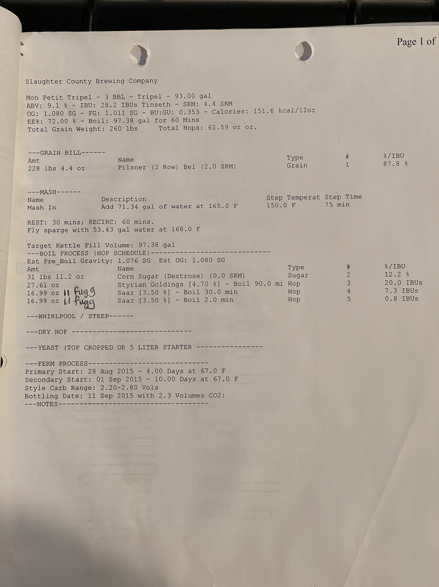

# Mon Petit Tripel - Belgian Tripel 

**Specs:** 93.00 gal | **ABV:** 9.1%  | **IBUs**: 28.2 IBUs Tinseth  | **SRM**: 4.4 SRM  
**OG**: 1.080 SG  | **FG**: 1.011 SG  | **BU:GU**: 0.353  | **Calories**: 151.6 kcal/12oz  
**Eff:**: 72.0%  | **Boil**: 97.38 gal for 60 mins   
**Total Grain Weight**: 260 lbs  | **Total Hops**: 61.59 oz   

## Grain Bill

| Amt            | Name                          | Type  | #   | %/IBU |
| -------------- | ----------------------------- | ----- | --- | ----- |
| 228 lbs 4.4 oz | Pilsner (2 Row) Bel (2.0 SRM) | Grain | 1   | 87.8% |

---

## Mash

**Mash In**: Add 71.34 gal of water at 165.0°F  | **Step Temp:** 150.0°F  | **Step Time:** 75 mins   

**Rest**: 30 mins; Recirculate: 60 mins  

Fly sparge with 53.43 gal water at 168.0°F  

Target Kettle Fill Volume: 97.38 gal

## Boil Additions (Hop Schedule)
**Est. Pre-Boil Gravity**: 1.076 SG  | **Est. OG**: 1.080 SG  

| Amt      | Name                            | Type  | Time     | #   | %/IBU     |
| -------- | ------------------------------- | ----- | -------- | --- | --------- |
| 18.00 oz | Corn Sugar (Dextrose) (0.0 SRM) | Sugar | 2 min    | 2   | 12.2%     |
| 27.61 oz | Styrian Goldings [4.70%]        | Hop   | 90.0 min | 3   | 20.2 IBUs |
| 16.99 oz | Saaz [3.50%]                    | Hop   | 30.0 min | 4   | 7.3 IBUs  |
| 16.99 oz | Saaz [3.50%]                    | Hop   | 2.0 min  | 5   | 0.8 IBUs  |

## Yeast
| Amount  | Name                  | Type  | #   | %/IBU |
| ------- | --------------------- | ----- | --- | ----- |
| 1.0 pkg | SafAle T-58 [23.66 m] | Yeast | 6   | -     |

## Notes
