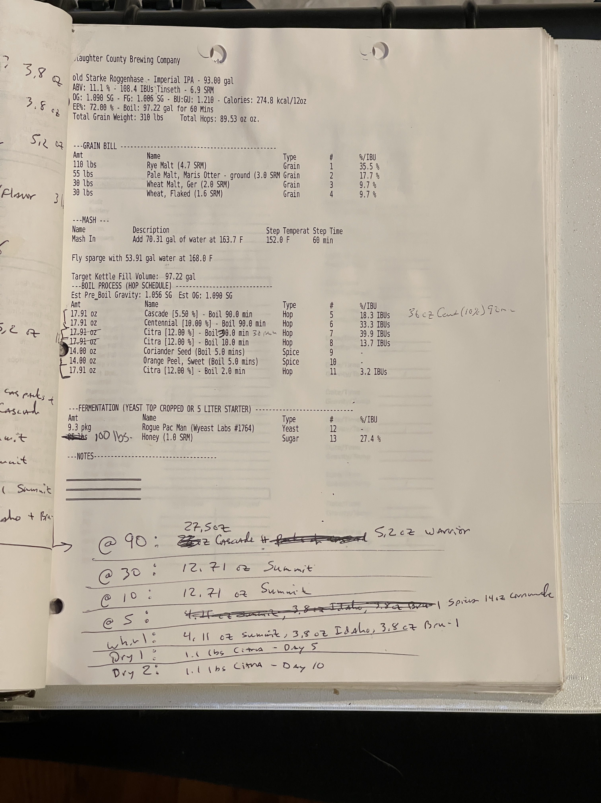

#  Starke Roggenhase - Rye Imperial IPA 

**Specs:** 93.00 gal |
**ABV:** 11.1 % | **IBU:** 166.4 IBUs Tinseth | **SRM:** 6.9 SRM  
**OG:** 1.098 SG | **FG:** 1.006 SG | **BU:GU:** 1.210 | **Calories:** 274.8 kcal/12oz  
**Eff:** 72.00 % | **Boil:** 97.22 gal for 60 Mins  
**Total Grain Weight:** 318 lbs |  **Total Hops:** 89.53 oz oz.

---GRAIN BILL------
Amt            Name                                      Type      #      %/IBU
110 lbs        Rye Malt (4.7 SRM)                       Grain     1      35.5 %
55 lbs         Pale Malt, Maris Otter - ground (3.0 SRM Grain     2      17.7 %
30 lbs         Wheat Malt, Ger (2.0 SRM)                Grain     3      9.7 %
30 lbs         Wheat, Flaked (1.6 SRM)                  Grain     4      9.7 %

--MASH---
Name           Description                               Step Temperat Step Time
Mash In        Add 70.31 gal of water at 163.7 F        152.0 F      60 min

Fly sparge with 53.91 gal water at 168.0 F

Target Kettle Fill Volume: 97.22 gal
---BOIL PROCESS (HOP SCHEDULE)----------------------
Est Pre_Boil Gravity: 1.056 SG Est OG: 1.099 SG
Amt            Name                                      Type      #      %/IBU
17.91 oz       Cascade [5.50 %] - Boil 90.0 min         Hop       5      18.3 IBUs
17.91 oz       Centennial [10.00 %] - Boil 90.0 min     Hop       6      33.3 IBUs
17.91 oz       Citra [12.00 %] - Boil 90.0 min          Hop       7      39.9 IBUs
17.91 oz       Citra [12.00 %] - Boil 10.0 min          Hop       8      13.7 IBUs
14.00 oz       Coriander Seed (Boil 5.0 mins)           Spice     9      -
14.00 oz       Orange Peel, Sweet (Boil 5.0 mins)       Spice     10     -
17.91 oz       Citra [12.00 %] - Boil 2.0 min           Hop       11     3.2 IBUs

---FERMENTATION (YEAST TOP CROPPED OR 5 LITER STARTER)-----------------
Amt            Name                                      Type      #      %/IBU
9.3 pkg        Rogue Pac Man (Wyeast Labs #1764)        Yeast     12     -
100 lbs        Honey (1.0 SRM)                          Sugar     13     27.4 %

---NOTES-----------------------

@ 90: 27.5oz Cascade & 5.2 oz Warrior
@ 30: 12.71 oz Summit
@ 10: 12.71 oz Summit
@ 5: 4.11 oz Summit, 3.8 oz Idaho, 3.8 oz Citra-1, Summit 14.2 Commingle
whirl: 4.11 oz Summit, 3.8 oz Idaho, 3.8 oz Citra-1
Dry 1: 1.1 lbs Citra - Day 5
Dry 2: 1.1 lbs Citra - Day 10

## Notes

