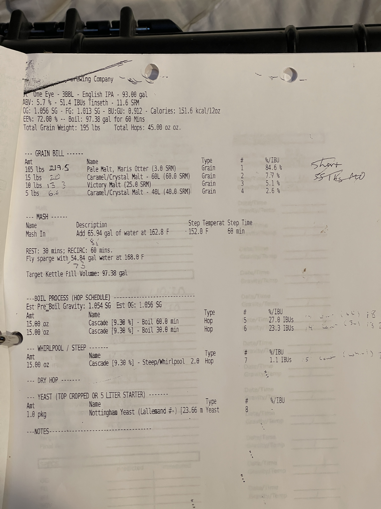

# Ol' One Eye - 3BBL - English IPA - 93.00 gal

```
ABV: 5.7 % - 51.4 IBUs Tinseth - 11.6 SRM
OG: 1.056 SG - FG: 1.013 SG - BU:GU: 0.912 - Calories: 151.6 kcal/12oz
EE%: 72.00 % -- Boil: 97.38 gal for 60 Mins
Total Grain Weight: 195 lbs    Total Hops: 45.00 oz oz.
```

## GRAIN BILL

| Amt     | Name                                  | Type  | #   | %/IBU  |
| ------- | ------------------------------------- | ----- | --- | ------ |
| 165 lbs | Pale Malt, Maris Otter (3.0 SRM)      | Grain | 1   | 84.6 % |
| 15 lbs  | Caramel/Crystal Malt - 60L (60.0 SRM) | Grain | 2   | 7.7 %  |
| 10 lbs  | Victory Malt (25.0 SRM)               | Grain | 3   | 5.1 %  |
| 5 lbs   | Caramel/Crystal Malt - 40L (40.0 SRM) | Grain | 4   | 2.6 %  |

## MASH

| Name    | Description                       | Step Temperat | Step Time |
| ------- | --------------------------------- | ------------- | --------- |
| Mash In | Add 65.94 gal of water at 162.0 F | 152.0 F       | 60 min    |

REST: 30 mins; RECIRC: 60 mins.
Fly sparge with 54.84 gal water at 168.0 F

Target Kettle Fill Volume: 97.38 gal

## BOIL PROCESS (HOP SCHEDULE)
Est Pre_Boil Gravity: 1.054 SG Est OG: 1.056 SG

| Amt      | Name                             | Type | #   | %/IBU     |
| -------- | -------------------------------- | ---- | --- | --------- |
| 15.00 oz | Cascade [9.30 %] - Boil 60.0 min | Hop  | 5   | 27.0 IBUs |
| 15.00 oz | Cascade [9.30 %] - Boil 30.0 min | Hop  | 6   | 23.3 IBUs |

## WHIRLPOOL / STEEP

| Amt      | Name                                   | Type | #   | %/IBU    |
| -------- | -------------------------------------- | ---- | --- | -------- |
| 15.00 oz | Cascade [9.30 %] - Steep/Whirlpool 2.0 | Hop  | 7   | 1.1 IBUs |

## DRY HOP

## YEAST (TOP CROPPED OR 5 LITER STARTER)

| Amt     | Name                                     | Type  | #   | %/IBU |
| ------- | ---------------------------------------- | ----- | --- | ----- |
| 1.0 pkg | Nottingham Yeast (Lallemand #-) [23.66 m | Yeast | 8   | -     |

## NOTES



- [ ] TODO - formatting