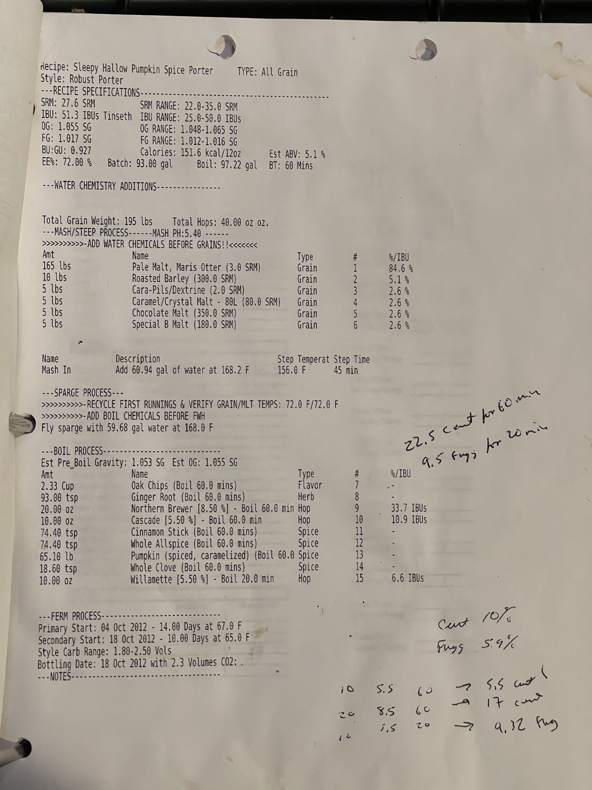

- [ ]  format
# Sleepy Hollow Pumpkin Porter  

---

### Recipe Specifications
- **SRM**: 27.6 SRM (Range: 22.0-35.0 SRM)  
- **IBU**: 39.6 IBUs Tinseth (Range: 25.0-50.0 IBUs)  
- **OG**: 1.053 SG (Range: 1.042-1.065 SG)  
- **FG**: 1.012 SG (Range: 1.010-1.016 SG)  
- **Effic.**: 72.0%  
- **Est. ABV**: 5.1%  
- **Batch Size**: 93.09 gal  
- **Boil Size**: 97.22 gal  
- **BT**: 60 mins  

---

### Water Chemistry Additions  

---

### Mash/Steep Process
- **Mash pH**: 5.40  
- **Add Water Chemicals Before Grains**
- #

 
## Grain Bill
| Amt     | Name                                  | Type  | %/IBU |
| ------- | ------------------------------------- | ----- | ----- |
| 165 lbs | Pale Malt, Maris Otter (3.0 SRM)      | Grain | 84.6% |
| 10 lbs  | Roasted Barley (300.0 SRM)            | Grain | 5.1%  |
| 5 lbs   | Cara-Pils/Dextrine (2.0 SRM)          | Grain | 2.6%  |
| 5 lbs   | Caramel/Crystal Malt - 80L (80.0 SRM) | Grain | 2.6%  |
| 5 lbs   | Chocolate Malt (350.0 SRM)            | Grain | 2.6%  |
| 5 lbs   | Special B Malt (180.0 SRM)            | Grain | 2.6%  |

## Mash-In
- Add 60.94 gal of water at 168.2°F  
- Step Temp: 156.0°F  
- Time: 45 mins  

---

## Sparge Process
- Recycle first runnings & verify grain/MLT temps: 72.0°F/72.6°F  
- Fly sparge with 59.68 gal water at 168.0°F  

---

## Boil Process
- **Est. Pre-Boil Gravity**: 1.053 SG  
- **Est. OG**: 1.055 SG  

#### Additions
| Amt       | Name                                        | Type   | Time   | %/IBU     |
| --------- | ------------------------------------------- | ------ | ------ | --------- |
| 23.32 cup | Oak Chips (Boil 60 mins)                    | Flavor | 60 min |           |
| 93.00 tsp | Ginger Root (Boil 60 mins)                  | Herb   | 60 min |           |
| 22.50 tsp | Cascade [5.5%] (Boil 60 min)                | Hop    | 60 min | 33.7 IBUs |
| 9.50 tsp  | Cinnamon Stick (Boil 60 min)                | Spice  | 60 min | 10.9 IBUs |
| 16.00 tsp | Whole Allspice (Boil 60 min)                | Spice  | 60 min |           |
| 45.00 tsp | Pumpkin (spiced, caramelized) (Boil 60 min) | Spice  | 60 min |           |
| 16.00 tsp | Whole Clove (Boil 60 min)                   | Spice  | 60 min |           |
| 18.00 oz  | Willamette [5.5%] (Boil 20 min)             | Hop    | 20 min | 6.6 IBUs  |

---

## Ferm Process
- Primary Start: Oct 4, 2012 – 14.06 days at 67.0°F  
- Secondary Start: Oct 18, 2012 – 10.96 days at 65.6°F  
- Style Carb Range: 1.8-2.5 Vols CO2  
- Bottling Date: Oct 28, 2012 with 2.3 Volumes CO2  

---

## Notes:
- (Handwritten calculations for additions and IBUs.)
